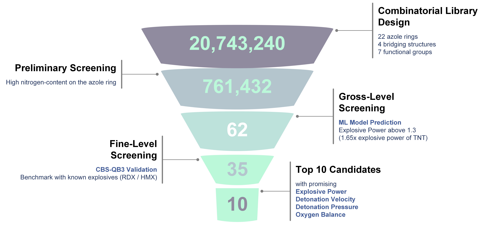

## Combining Machine Learning and Quantum Chemistry to Discover New Energetic Materials in Bis-Azole Derivatives
This repository contains the data and model for the virtual screening framework of bis-azole derivatives.

The manuscript of this repository is in preparation.

<!--  -->


## OS Requirements
This repository requires to operate on **Linux** operating system.

## Python Dependencies
* Python (version >= 3.8)
* chemprop  (version >= 1.3.1)
* rdkit (version >= 2020.03.6)
* scikit-learn (version >= 1.0.2)
* torch (versioin >= 1.12.0)
* matplotlib (version >=3.7.4)
* numpy (version >= 1.24.4)
* pandas (version >= 1.1.3)


## Installation
```bash
conda env create -f environment.yml
```

## Datasets
Additionally, the training and testing sets, as well as the model checkpoints for the BoB (Bag-of-Bonds) model, and the optimized molecule structure files (.xyz) used for feature generation, can be downloaded using gdown:

```bash
gdown https://drive.google.com/drive/folders/1ln6K561FxiqqGZ2n-LmJaAnrJtuleE-U?usp=drive_link --folder
```

